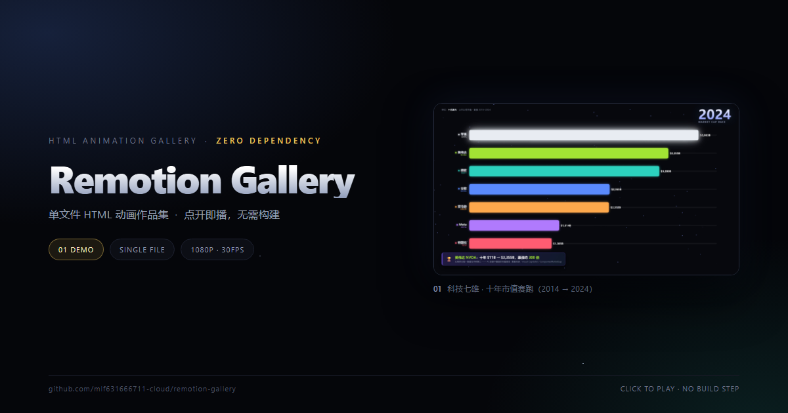

# Magnificent 7 · A Decade of Market Cap Race

**科技七雄 · 十年市值赛跑（2014 → 2024）**

[中文](README.md) · **English**



A zero-dependency, single-file HTML data animation: seven tech giants race bar-by-bar through ten years of market cap. The title card pops in letter by letter under a light sweep, the bars grow from real year-end market-cap values while their ranking eases into place, and the end card calls out NVIDIA's roughly **300×** decade.

## Files

| File | Description |
|---|---|
| `effects.html` | **Original build.** Self-contained single file (zero external dependencies) — double-click to play. Driven by CSS `@keyframes` + `requestAnimationFrame`. |
| `effects.render.html` | **Frame-render build.** Exposes `window.__seek(t)` / `window.__duration`. All CSS animation and accumulated state removed (particles replay deterministically), so any `t` resolves independently — required for stable frame-by-frame export. |
| `mag7_1920x1080.mp4` | Rendered video: 1920×1080 / 30 fps / 10.4 s / 1.6 MB |
| `preview.png` | Still frame from the end card (the cover above) |

## Structure (10.4 s total)

| Segment | Time | What happens |
|---|---|---|
| Intro | 0 – 1.75 s | Kicker + title pop in letter by letter (`translateY(34px) scale(.6)` → settled) under a light sweep crossing left to right |
| Race | 1.75 – 9.0 s | 7 bars grow by linear interpolation of market cap; the axis rescales dynamically with `dynMax = maxV × 1.08`; rankings swap with `_disp += (rank − _disp) × 0.16` easing; the year counter follows |
| Outro | 9.0 – 10.4 s | Lower third: NVIDIA NVDA, ten years `$11B → $3,355B`, a **~300×** gain |

## Data (USD billions)

| Company | 2014 | 2015 | 2016 | 2017 | 2018 | 2019 | 2020 | 2021 | 2022 | 2023 | 2024 |
|---|---|---|---|---|---|---|---|---|---|---|---|
| Apple AAPL | 643 | 584 | 609 | 861 | 746 | 1287 | 2255 | 2901 | 2066 | 2994 | **3863** |
| Microsoft MSFT | 382 | 440 | 483 | 660 | 780 | 1200 | 1681 | 2522 | 1787 | 2794 | **3200** |
| NVIDIA NVDA | 11 | 18 | 58 | 117 | 81 | 144 | 323 | 735 | 364 | 1223 | **3355** |
| Alphabet GOOG | 360 | 528 | 539 | 729 | 724 | 921 | 1185 | 1917 | 1145 | 1756 | **2365** |
| Amazon AMZN | 144 | 318 | 356 | 564 | 737 | 920 | 1634 | 1691 | 857 | 1570 | **2352** |
| Meta | 217 | 297 | 332 | 513 | 374 | 585 | 778 | 922 | 320 | 910 | **1514** |
| Tesla TSLA | 28 | 32 | 34 | 52 | 57 | 76 | 669 | 1061 | 389 | 790 | **1385** |

Source: Visual Capitalist / CompaniesMarketCap — USD billions, year-end values.

## Make it your own

Everything lives in the `PRESETS` array. Add one preset object and you are done:

```js
{
  id:'your-id', label:'name shown in the dropdown',
  kicker:'small text on top', title:'main title', sub:'subtitle', unit:'unit line',
  years:[2020,2021,2022,2023,2024],
  fmt: v => '$' + Math.round(v) + 'B',
  outro:{ emoji:'🏆', title:'outro title', desc:'outro description' },
  companies:[ {key, name, tk, c, v:[/* one value per year */]} ]
}
```

## Turning the HTML into an MP4

```
1. Open effects.render.html with Playwright / Puppeteer
2. For each t (t = i/30, i = 0..N-1): call window.__seek(t), then screenshot
3. ffmpeg -framerate 30 -i f_%04d.png -c:v libx264 -crf 14 -pix_fmt yuv420p out.mp4
```

To supersample, screenshot with `deviceScaleFactor: 2` (renders at 3840×2160) and downsample while encoding with `-vf scale=1920:1080`.

## Two implementation gotchas

- **Bar width is clamped**: `pct = clamp(v / dynMax * 100, 2, 94)`. So the shortest bar (Tesla) looks longer than a strictly linear scale would suggest — that is the intentional 2% floor, not a bug.
- **`effects.html` does not satisfy the frame-seek contract**: it relies on CSS animation plus rAF accumulated state, so the same `t` can render differently across two runs. Use `effects.render.html` for export.

## License

Code is free to study and remix. Data is compiled from public sources — please credit Visual Capitalist / CompaniesMarketCap.
